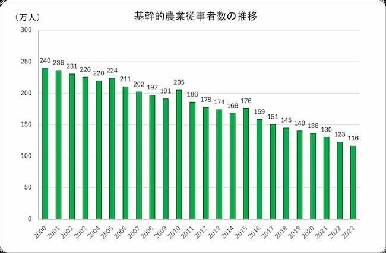

<!--
headingDivider: 2
-->

<!-- _class: lead -->
# 情報連携チーム実習 日本の農業について
1F10230101 大久保碩起
<!-- {名前}です。発表を始めます。 -->
# 日本の農業地域が抱える主な課題
- **農業人口の減少と高齢化の進行**
- **農家所得の低迷と耕作放棄地の拡大**
<!-- 農業は地域経済の基盤ですが、担い手不足と収益性の低さが深刻です。 -->

# 農業人口の減少と高齢化
- 基幹的農業従事者数：2000年 **240 万人 → 2023 年 116 万人**
- 65 歳以上比率：2023 年 **約 70 %**

> - https://minorasu.basf.co.jp/80076
<!-- 若年農業者が減り、地域コミュニティ維持も困難になっています。 -->

# 農家所得の低迷と耕作放棄地
- 農業総産出額：1980年代 11 兆円台 → 2020 年 **約 8.9 兆円**
- 生産農業所得：2020 年 **3.3 兆円（前年比 +0.7%）**
- 耕作放棄地：1995 年 24 万 ha → 2015 年 **42 万 ha**

> - https://www.maff.go.jp/j/tokei/

# 政府の主な対策（過去 10 年）
| 年 | 政策・制度 | 目的 | ポイント |
|----|------------|------|----------|
| 2012 | 青年就農給付金 →  農業次世代人材投資資金 | 新規就農者支援 | 最大 150 万円/年 ×5|
| 2014 | 農地中間管理機構（農地バンク） | 農地集約 | 高齢農家の農地を担い手へ |
| 2015 | 中山間地域等直接支払 | 条件不利地維持 | 集落活動に最大 8,000 円/10a|
| 2018 | 農泊推進交付金 | 農村観光振興 | 2020 年までに 500 地域目標|
| 2020 | スマート農業工程表 | DX 推進 | WAGRI・標準化・5G 展開|
<!-- 政策は担い手確保・農地保全・DX・観光の4 本柱で進行中。 -->

# スマート農業導入状況
- **データ活用型農業経営体：23.3 %（2022）**
  - 法人経営では **58 %** が何らかの ICT を導入
- 代表的技術
  - GPS 自動操舵トラクター
  - ドローン農薬散布・リモートセンシング
  - AI 温室環境制御・収量予測

<!-- 高齢農家でも使える低コスト機器とアプリが普及鍵。 -->

# ケーススタディ①　長野県
- 高齢化率 **73.5 %** と山間地の耕作放棄リスク
- 県独自の **里親研修制度** と「デジタル農活信州」で就農マッチング
- 果樹輸出拡大：県産品ブランド「おいしい信州ふーど」

<!-- 産地力 + デジタル就農支援で若手呼び込み。 -->

# ケーススタディ②　小豆島（香川県）
- 放棄棚田を **オリーブ畑** に再生（耕作放棄地再生支援事業）
- 企業参入 × 六次産業化 → オリーブオイル・観光体験
- 年 10 名以上の若手人材を全国採用し雇用創出

<!-- 農業＋観光ブランドで交流人口を拡大。 -->

# ケーススタディ③　熊本県
- 農業産出額 全国 5 位、スマート農業実証多数
- 「スーパー中山間地域」モデルで集落営農・複合経営を支援
- ドローン稲作・AI ハウス・牛個体センサー導入

<!-- 大規模平野と中山間、両方を支える二層政策。 -->

# チーム実習でなにをするべきか？
### 生成 AI × 農泊観光プラン設計
1. **旅行者プロファイル取得**（チャットボット質問）
2. **圃場データ × 天気 × 季節行事** を LLM が自動解析
3. **多言語プラン生成**：農業体験 + 文化 + 食 × パーソナライズ
4. **SNS コンテンツ自動生成**（写真/ストーリー）
<!-- 個別最適化＆コスト低減で農村観光の魅力を最大化。 -->

# チーム実習での活動計画
| 月 | 主要タスク | 成果物 | 担当例 |
|----|-----------|--------|--------|
| 5–6 月 | 課題・顧客仮説、BMC | BMC/ペルソナ | 企画班 |
| 7–9 月 | データ収集・AI プロトタイプ | LLM 旅程 API | AI班 |
| 10–11 月 | IoT & Web ダッシュボード | Rust GW + Svelte | 開発班 |
| 12 月 | ユーザーテスト & 改善 | POC レポート | 全体 |
<!-- 生成AIチャット・IoT連携のMVPを12月までに完成。 -->

# 私が貢献できるスキル
- Rust / Python による **IoT ゲートウェイ実装**
- Django・FastAPI・React での **Web フロント開発**
- GitHub Actions / Docker を用いた **CI/CD**
- 統計解析・データ可視化（Python, Pandas, Matplotlib）
<!-- 技術面でプロトタイプ構築とデータ分析をリードできます。 -->

# 参考文献
> - 農林水産省「農林業センサス」2022
> - minorasu.basf「基幹的農業従事者数の推移」https://minorasu.basf.co.jp/80076
> - 農林水産省「耕作放棄地に関する統計」https://www.maff.go.jp/j/tokei/
> - 農林水産省「スマート農業実証」https://www.maff.go.jp/j/kanbo/smart/
> - 長野県「食と農業農村振興計画」
> - 香川県「オリーブ振興特区」
> - 熊本県「くまもと農業基本計画」
> - 観光庁「農泊の推進について」
